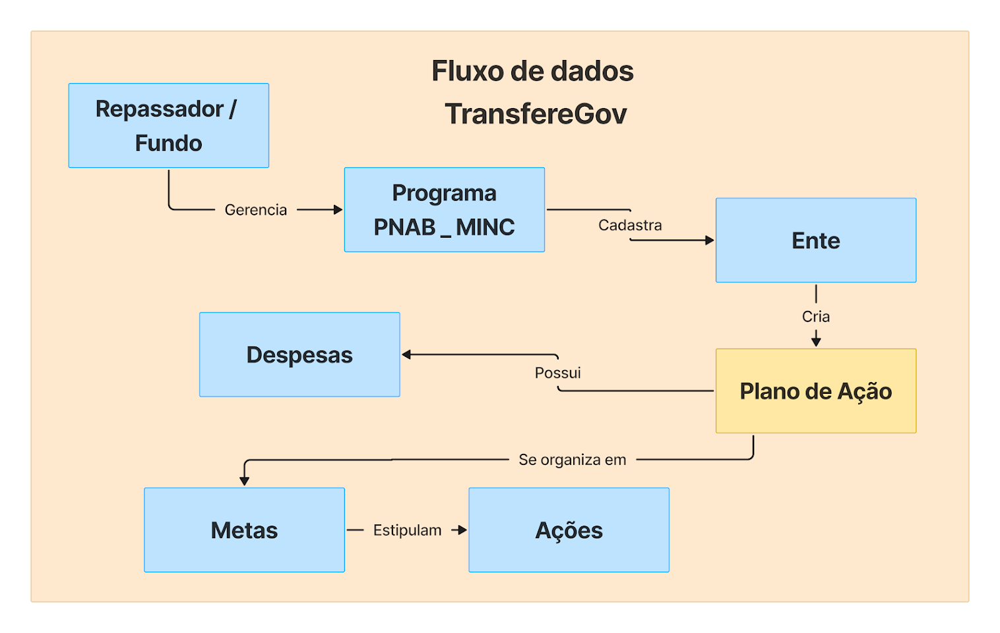
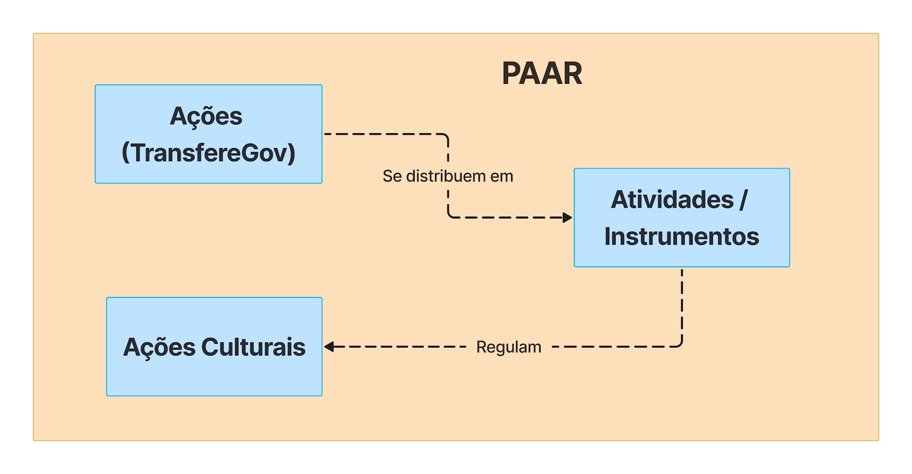

### 2.1.2 - Análise do fluxo de execução orçamentária da PNAB, mapeando integrações com TranfereGov e com o Plano Anual de Aplicação de Recursos - PAAR

#### I. Do repasse do recurso orçamentário da União

A partir das definições das frações do orçamento para cada ente beneficiário, disposto em norma legal, este deve criar um plano de ação definindo como o recurso será executado a priori. O plano de ação é composto por metas, que no escopo da PNAB são duas: Ações Gerais e Política Nacional Cultura Viva. O ente federado definirá quais os montantes serão aplicados para ações específicas, tais como fomento cultural, obras, reformas e aquisições de bens culturais, custo operacional e premiação de pontos de cultura, por exemplo. A definição dos montantes seguem os estipulados por leis específicas e suas devidas aplicações compulsórias. Na Figura 1 é apresentado um pseudo Modelo Entidade Relacionamento (MER) descrevendo o fluxo orçamentário relacionado ao TransfereGov.

**
**Figura 1: Etapa de repasse do recurso da União**
**

#### II. Da granularização da aplicação dos recursos com o PAAR

Durante a criação do plano de ação de execução dos recursos orçamentários da PNAB, é demandada a apresentação de um documento suplementar que é o PAAR.

O PAAR refina a aplicação de recursos definidos nas ações do plano de trabalho. Neste caso, as ações gerais são subdivididas em fomento cultural, obras, reformas e aquisições de bens culturais, custo operacional e subsídio e manutenção de espaços e organizações culturais. Já para o Cultura Viva em fomento a projetos continuados de pontos de cultura, fomento a projetos continuados de pontões de cultura e premiação de pontos de cultura.

As ações são subdivididas em atividades elencadas no Art. 5º da Lei 14.399/2022, podendo ser apoio a festivais, festas populares, feiras e produção de espetáculos, concessão de bolsas culturais, premiação, dentre outros (BRASIL, 2022). Também são definidos os valores associados, a forma do regime jurídico associado, a entrega, bem como suas quantidades. Tal representação/fluxo é apresentado na Figura 2.

**
**Figura 2: Fluxo e estruturação das informações no PAAR**
**
